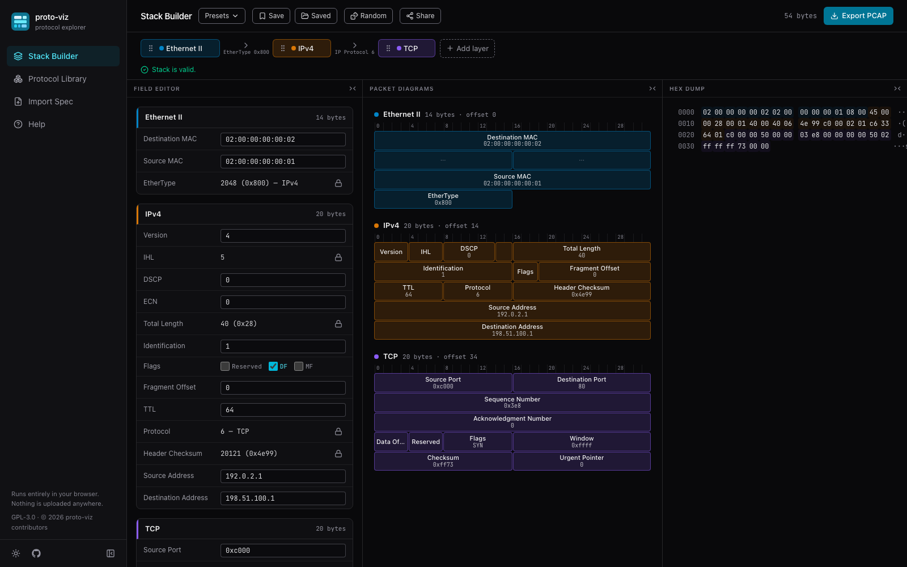

# proto-viz

A polished, fully client-side web app for exploring and visualising network
protocols and protocol stacks. Everything — protocol modeling, stack
validation, packet serialization, PCAP generation, and RFC parsing — runs in
your browser. Nothing is uploaded anywhere.



## Features

- **Protocol library** — 23 built-in protocols with full bit-level field
  layouts: Ethernet II, 802.1Q, ARP, IPv4, IPv6, ICMP, ICMPv6, IGMP, TCP,
  UDP, SCTP, DNS, DHCP, HTTP/1.1, TLS record, NTP, GRE, VXLAN, MPLS, OSPF,
  BGP, PPPoE, L2TP.
- **Stack builder** — compose arbitrary stacks (VXLAN overlays, Q-in-Q,
  GRE tunnels, MPLS label stacks…). Validity is checked from a generic
  binding model (EtherType / IP protocol / port assignments): illegal
  layerings are explained ("TCP cannot follow Ethernet II: Ethernet selects
  its payload via EtherType, and TCP has no assignment there"), and carrier
  selector fields are auto-set from the layer above them. Stacks can be
  saved to the browser (IndexedDB) and reloaded, including field edits and
  payload. A dice button generates a random stack via a random walk over
  the binding graph — always valid by construction — and the payload editor
  can fill itself with random bytes.
- **Packet visualisation** — classic RFC-style 32-bit-per-row diagrams, a
  full-packet hex dump with layer tinting, and a typed field editor.
  Hovering a field highlights it in all three views. Computed fields
  (lengths, IHL/data offset, checksums incl. TCP/UDP pseudo-header and
  SCTP CRC32c) update live and can be pinned to deliberate wrong values.
- **PCAP export** — download classic pcap files: single packets or generated
  sequences (TCP three-way handshake, DNS query/response, ICMP ping pair,
  DHCP DORA) with coherent sequence numbers, flipped directions, and fresh
  checksums per packet.
- **Spec import** — upload an RFC or protocol spec as TXT, HTML, DOCX, or
  PDF. ASCII packet diagrams (including RFC 768's 1-char-per-bit style and
  DNS's 16-bit rows) are detected and parsed with confidence scoring, then
  reviewed in an editable form with a live diagram preview before joining
  the library. Custom protocols persist in IndexedDB and can be exported /
  imported as JSON. Legacy binary `.doc` is detected and rejected with
  guidance (it cannot be parsed in-browser).

## Running

```bash
npm install
npm run dev            # development server
npm test               # vitest unit suite (236 tests)
npm run test:coverage  # suite + V8 coverage report (~90% lines on core logic)
npm run build          # static production build in dist/
npx serve dist         # serve the production build locally
```

The build is fully static — host `dist/` on GitHub Pages (a deploy workflow
is included) or any static file server. Routing uses URL hashes, so no
server-side rewrites are needed. Note: the pdf.js worker requires an HTTP
origin, so PDF import doesn't work when opening `index.html` via `file://`;
use `npx serve dist` instead.

## Verifying generated PCAPs

Exported files are classic pcap (microsecond, little-endian). To verify:

- **Wireshark**: open the file. Enable checksum validation under
  *Preferences → Protocols → IPv4 / TCP / UDP → Validate checksums* — packets
  should show no malformed expert-info and checksums report `correct`.
- **tcpdump / tshark**:

  ```bash
  tcpdump -r export.pcap -vvv    # look for "cksum ... (correct)"
  tshark -r export.pcap -V
  ```

The unit suite includes byte-exact golden packets with hand-computed
checksums; the full library was additionally validated against `tcpdump`.

## Architecture

All protocol logic lives in pure TypeScript modules with no DOM
dependencies (`src/core`, `src/protocols`, `src/import`), unit-tested under
vitest's node environment:

- `core/model.ts` — `ProtocolDefinition` / `FieldDef` data model. Field
  layouts are bit-level; computed fields (expressions, checksums, binding
  auto-set) are declared as JSON-serializable ASTs so imported custom
  protocols persist cleanly.
- `core/serialize.ts` — three-pass serializer (layout → computed values →
  checksums, innermost-first where order matters) producing bytes plus a
  bit-exact field-span map that drives the hex view and hover linking.
- `core/bindings.ts` + `core/validate.ts` — the encapsulation model:
  protocols *provide* namespaces (EtherType, IP protocol, ports…) and
  *claim* membership; validation and palette filtering both derive from the
  intersection, and error messages are generated from the same data.
- `core/pcap.ts` / `core/scenarios.ts` — pcap writer and multi-packet
  scenario generators.
- `import/` — text extraction per format and the ASCII-diagram parser with
  confidence scoring.
- `ui/` — React + Tailwind interface; zustand stores; IndexedDB persistence.

## Accessibility

The app targets WCAG 2.2 AA. Both themes pass axe-core's WCAG 2.x A/AA
ruleset with zero violations; text and borders meet contrast minimums in
dark and light mode. Everything is keyboard-operable: bit-grid fields are
focusable toggle buttons that drive the cross-view highlight, layers
reorder via their drag handle (Space to lift, arrows to move), dialogs
trap and restore focus and close on Escape, and validation results are
announced via a polite live region. The hex view's per-byte hover is
pointer-only, but every byte's field is equally reachable through the
diagram and field editor.

To re-run the automated audit: build, serve `dist/`, and run axe-core
(installed as a dev dependency) against each route.

## Security

proto-viz has no server: uploads, custom protocols, and generated PCAPs never
leave the browser. The inputs it parses are still treated as untrusted:

- Uploaded specs are size-capped (20 MB); HTML/DOCX content is sanitized
  with DOMPurify, then parsed with the inert `DOMParser` (never injected
  into the page), and pdf.js runs with `isEvalSupported: false`. Legacy
  binary `.doc` is rejected outright.
- Imported library JSON is schema-validated with sanity caps (protocol/field
  counts, name lengths, field widths), and the serializer enforces
  per-field and per-packet allocation limits, so a hostile definition file
  can't hang the tab.
- The production build ships a same-origin Content-Security-Policy
  (`script-src 'self'`, `object-src 'none'`, …) as a `<meta>` tag, since
  GitHub Pages can't set headers.
- CI runs `npm audit` and CodeQL on every push and weekly
  (`.github/workflows/security.yml`); Dependabot watches npm and Actions.

To report a vulnerability, please open a GitHub security advisory rather
than a public issue.

## License

Copyright (C) 2026 proto-viz contributors.

This program is free software: you can redistribute it and/or modify it
under the terms of the GNU General Public License as published by the Free
Software Foundation, version 3. It is distributed in the hope that it will
be useful, but WITHOUT ANY WARRANTY; without even the implied warranty of
MERCHANTABILITY or FITNESS FOR A PARTICULAR PURPOSE. See the
[LICENSE](LICENSE) file for the full text.
