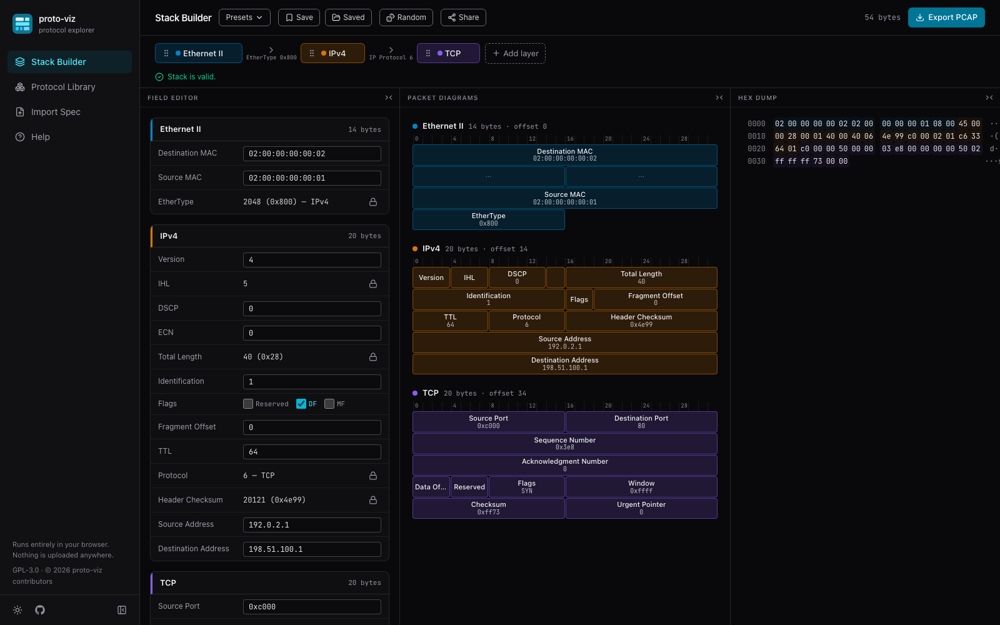

<p align="center">
  
</p>

<h1 align="center">proto-viz</h1>

<p align="center">
  <a href="https://github.com/theceej/proto-viz/actions/workflows/ci.yml"></a>
  <a href="https://github.com/theceej/proto-viz/actions/workflows/security.yml"></a>
  <a href="https://github.com/theceej/proto-viz/actions/workflows/deploy.yml"></a>
  <a href="LICENSE"></a>
  <a href="https://theceej.github.io/proto-viz/"></a>
</p>

A polished, fully client-side web app for exploring and visualising network
protocols and protocol stacks. Everything — protocol modeling, stack
validation, packet serialization, PCAP generation, and RFC parsing — runs in
your browser. Nothing is uploaded anywhere.



## Features

- **Protocol library** — Dozens of built-in protocols with full bit-level
  field layouts. Core: Ethernet II, 802.3 (LLC and SNAP), 802.1Q, ARP, IPv4,
  IPv6 (with Hop-by-Hop, Routing, Fragment, and Destination Options extension
  headers), ICMP, ICMPv6 (incl. NDP and MLDv2), IGMP v2/v3, TCP, UDP, SCTP,
  EAPOL/802.1X. Infrastructure: STP, LLDP, CDP, VRRP, HSRP, RIPv1/v2,
  EIGRP, OSPF, IS-IS, BGP, BFD, PIM,
  NetFlow v5. Applications: EAP, DNS, mDNS, LLMNR, NBNS, DHCP, DHCPv6, HTTP/1.1,
  HTTP/2, WebSocket, TLS record, QUIC, NTP, TFTP, RADIUS, STUN, RTP, RTCP,
  SIP, RTSP, MQTT, CoAP, Modbus TCP, SMB2, FTP, SMTP, POP3, IMAP, Telnet,
  IRC, Syslog, SSDP. Tunnels & VPN: GRE, VXLAN, GENEVE, MPLS, GTP-U, IPsec
  AH/ESP, WireGuard, PPPoE, L2TP. RFC references in the library link to the
  full documents. The library is searchable, groups protocols by layer with
  an OSI-model overlay, and can be re-sorted into a flat A–Z list.
- **Stack builder** — compose arbitrary stacks (VXLAN overlays, Q-in-Q,
  GRE tunnels, MPLS label stacks…). Validity is checked from a generic
  binding model (EtherType / IP protocol / port assignments): illegal
  layerings are explained ("TCP cannot follow Ethernet II: Ethernet selects
  its payload via EtherType, and TCP has no assignment there"), and carrier
  selector fields are auto-set from the layer above them. A grouped Presets
  picker loads canonical examples — each with a one-line description of what
  it demonstrates — from a TCP SYN or an example.com DNS query to a VXLAN
  overlay; some carry deliberate field edits (an established ACK+PSH data
  segment, a RST reset). Stacks can be
  saved to the browser (IndexedDB) and reloaded, including field edits and
  payload. A dice button generates a random stack via a random walk over
  the binding graph — always valid by construction — and the payload editor
  can fill itself with random bytes. Any stack of built-in protocols can be
  shared as a short word code (a What3Words-style handle: Ethernet › IPv4 ›
  TCP becomes `army.borrow.advice`) drawn from the BIP-39 wordlist, with a
  checksum that rejects mistyped codes; the code also embeds in a link that
  opens the stack directly. The word code carries the layer structure only,
  while an optional "exact packet" link additionally restores every field
  edit and the payload. The decoder runs the other way: paste packet
  hex (Wireshark's "copy as hex stream", or the hex view's own copy
  button) and the stack is identified by walking the same binding model —
  computed fields that don't reproduce the pasted bytes, like a wrong
  checksum, are pinned so the exact packet is preserved.
- **Packet visualisation** — classic RFC-style 32-bit-per-row diagrams, a
  full-packet hex dump with layer tinting whose hex and ASCII columns toggle
  independently, and a typed field editor. Toggle the hex view's Edit mode and
  the bytes become editable — type two digits over a byte and the field editor,
  diagram, and validation update live; hand-editing a computed field (a
  checksum, a length) pins it to the entered bytes, the same way the decoder
  preserves a wrong checksum.
  Hovering a field highlights it in
  all views, and selecting one opens an inspector that explains its value and
  links its spec; an inspection-detail control (Compact / Explain / Deep)
  tunes how much interpretation the views show. Computed fields (lengths,
  IHL/data offset, checksums incl. TCP/UDP pseudo-header and SCTP CRC32c)
  update live and can be pinned to deliberate wrong values. A field-anchored
  semantic linter warns about encodable but suspicious values—such as zero hop
  limits, reserved bits, contradictory TCP flags, invalid IPv6 UDP checksums,
  and implausible source addresses—without preventing export or sharing. A
  guided tour, restartable from Help, walks through the whole workflow.
- **Scenario timeline** — replay a stack's generated exchange (TCP handshake,
  DNS query/response, ICMP ping, DHCP DORA, ARP/NDP resolution) as an animated
  packet timeline. Previous / Play-Pause / Next controls (keyboard-operable)
  step between messages; each step shows its direction between the two
  endpoints and loads that packet into the diagram, hex, validation, and
  read-only field views. Respects the reduced-motion preference.
- **Capture viewer** — open a pcap or pcapng file and read it packet by
  packet. Both containers are parsed in the browser, in either byte order and
  at microsecond or nanosecond resolution; pcapng's per-interface link types
  and `if_tsresol` scales are honoured rather than assumed file-wide, unknown
  block types are skipped, and per-packet comments appear against the packets
  they annotate. Ethernet, raw IP, IPv4, and IPv6 link types decode
  through the same binding walk as the hex decoder, and anything else is
  rejected by name rather than mis-dissected. A sortable packet list (number,
  time, endpoints, protocol, length, summary) sits under a time-axis strip
  that shows bursts and gaps, and selecting a packet loads it into the
  existing field, diagram, and hex panes. Packets that a snap length cut
  short, or that no layer could be read from, still appear with their bytes
  and an explanation. Structured filters — protocol, address, port, length,
  decode status, and free text over decoded field values — combine, and
  packets group into bidirectional flows with endpoint, protocol, packet,
  byte, and duration summaries; any two can go to Packet Comparison. Files
  are size- and packet-capped so a large capture cannot hang the tab, and
  nothing is uploaded.
- **PCAP export** — download classic pcap or pcapng: single packets or the
  same generated sequences with coherent sequence numbers, flipped
  directions, and fresh checksums per packet. Classic pcap is the default for
  maximum compatibility; pcapng additionally carries each packet's scenario
  step name ("SYN", "SYN-ACK", "DORA: Offer") as a per-packet comment, which
  Wireshark and the capture viewer both show — so an exported exchange
  reopens explaining itself.
- **Packet Lab** — two destructive workbenches that can hand packets to each
  other. *Fragmentation* splits the current packet at a chosen MTU and steps
  through each IPv4/IPv6 fragment, then disturbs delivery — missing,
  duplicate, overlapping, out-of-order — and diagnoses why duplicates and
  reordering still reassemble while gaps stay incomplete and overlaps are
  ambiguous. *Fuzzing* is the open-ended counterpart to the guided "break this
  packet" experiments. Pick a scope (whole packet, chosen layers, or a byte
  range), a strategy (random bit flips, zeroed bytes, boundary values, or
  driving a length field to its maximum), and a seed; length-changing
  mutations — truncating a packet short of what its headers claim, or
  appending bytes nothing accounts for — sit behind an advanced toggle. Every
  run is reproducible from its seed, and mutated bits are marked in both the
  bit diagram and the hex dump. A diagnosis panel reports what a receiver
  would make of it: how far a dissector gets before it stops and why, then
  only the validation and lint failures the mutation actually *introduced*.
  Length-preserving results fold back into an ordinary stack, so they export
  as PCAP and share as an exact-packet link — with any computed field the
  corruption invalidated pinned, because a bit flip in transit does not repair
  a checksum. A campaign runs one strategy across many seeds and groups the
  outcomes, which is how the few mutations that break something become visible
  among the many that do not.

  The two compose, which is the reason they share a page: **Fuzz this
  fragment** sends one fragment of a datagram to the fuzzer, and **Fragment
  this packet** sends a corrupted packet to the fragmenter — so "does
  reassembly survive a corrupted fragment?" is two clicks rather than
  unanswerable. Each tab remembers its own source packet, and a banner names
  it whenever a tab is working on something other than the Builder's stack.
  Nothing is transmitted anywhere.
- **Packet practice** — an "identify the packet" drill built from the same
  metadata everything else runs on. A packet is drawn (a random walk over the
  encapsulation graph, or one of the builder presets) and shown as an
  *unannotated* hex dump — no layer tinting, no field names, nothing that
  would answer the question. Three question types are generated: which
  protocol owns a highlighted header, which field a highlighted span is, and
  what a field's value is or, for fields with an enum table, what that value
  means. Wrong options are drawn from the nearest plausible neighbours — a
  sibling field of the same header, a protocol that could legally have sat in
  that position, another label from the same enum table — so the exercise
  can't be won by elimination. Answering reveals the correct option, an
  explanation, the specification link, and a button that loads the packet
  into the Stack Builder with the field selected. A session score tracks
  accuracy and streak. Because questions come from the definitions rather
  than a question bank, protocols you import are included with no extra work.
- **Spec import** — upload an RFC or protocol spec as TXT, HTML, DOCX, or
  PDF. ASCII packet diagrams (including RFC 768's 1-char-per-bit style and
  DNS's 16-bit rows) are detected and parsed with confidence scoring, then
  reviewed in an editable form with a live diagram preview before joining
  the library. Custom protocols persist in IndexedDB and can be exported /
  imported as JSON. Legacy binary `.doc` is detected and rejected with
  guidance (it cannot be parsed in-browser).
- **Workspace transfer** — export custom protocols, saved stacks, the current
  Builder stack, packet comparisons, and the composed scenario as a portable
  `.proto-viz-workspace.json` file. Import is locally parsed and fully reviewed
  before writes, with per-category merge/replace and conflict controls. Referenced
  custom protocols are included automatically; captures and preferences are not.
  See [the workspace format](docs/workspace-format.md) for the schema and limits.

## Running

```bash
npm install
npm run dev            # Development server
npm test               # Run the Vitest unit suite
npm run test:coverage  # Run the Vitest suite with V8 coverage
npm run test:e2e       # Build and run Playwright browser/a11y tests
npm run test:tshark    # Validate exported PCAPs (requires tshark)
npm run build          # Static production build in dist/
npx serve dist         # Serve the production build locally
```

Spec references in the library link to their published source. Each family
resolves through a URL *template* containing `%s` — replaced by the reference
identifier, like a browser's keyword-search URL — which can be pointed at a
mirror at build time. Because the whole path is templated, a mirror can put
the number wherever it needs (a `.txt` suffix, no `rfc` prefix, and so on),
not just swap the host:

| Reference | Env var | Default template |
| --- | --- | --- |
| RFC | `VITE_RFC_BASE_URL` | `https://www.rfc-editor.org/rfc/rfc%s` |
| 3GPP TS | `VITE_3GPP_BASE_URL` | `https://www.3gpp.org/DynaReport/%s.htm` |
| Microsoft (MS-*) | `VITE_MS_SPECS_BASE_URL` | `https://learn.microsoft.com/openspecs/windows_protocols/%s/` |
| IEEE | `VITE_IEEE_BASE_URL` | `https://standards.ieee.org/search/?q=%s` |

```bash
# examples — use the IETF datatracker for RFCs and an IEEE mirror
VITE_RFC_BASE_URL=https://datatracker.ietf.org/doc/html/rfc%s \
VITE_IEEE_BASE_URL=https://standards.example.edu/ieee/%s \
  npm run build
```

An override without a `%s` is accepted as a legacy base URL — the family's
default deep-link tail is appended — so earlier base-only overrides keep
working. IEEE has no stable per-designation document URL (the real URLs use
internal ids), so the default template runs a standards search rather than a
direct link; a mirror can template a direct-link scheme instead. A few
one-off references (WireGuard whitepaper, MQTT/OASIS)
link to their single canonical source; others without a public spec URL
(Cisco, Modbus, UPnP) stay as plain text.

The build is fully static — host `dist/` on GitHub Pages (a deploy workflow
is included) or any static file server. Routing uses URL hashes, so no
server-side rewrites are needed. Note: the pdf.js worker requires an HTTP
origin, so PDF import doesn't work when opening `index.html` via `file://`;
use `npx serve dist` instead.

The production build is also an installable progressive web app. After one
successful load, the builder and protocol library can be reopened offline.
Updates are installed only after the in-app prompt is accepted, avoiding a
mix of assets from different releases. The comparatively large PDF and DOCX
import modules are not part of the initial offline download; each becomes
available offline after that import format has been used successfully once.
Uploaded documents, custom protocol data, and generated packet files are not
stored in the service-worker cache (custom protocols continue to use the
app's existing IndexedDB storage).

`npm run check:bundle-size` budgets the build by what a visitor actually
downloads rather than by what is deployed. The **initial download** — the
entry chunk plus the static imports `dist/index.html` lists as
`modulepreload` — is the headline number and the one that catches a lazy
route being pulled into the eager graph. Route chunks are budgeted
individually (the largest one), and pdf.js, its worker, and mammoth are
reported separately because they load only for a PDF or DOCX spec import;
counting them in a single total made them dominate a figure most visitors
never pay. Every run prints exact gzip byte counts, so re-baselining after a
deliberate change is copying one line.

## Verifying generated PCAPs

Exported files are classic pcap (microsecond, little-endian) or pcapng
(little-endian, microsecond `if_tsresol`, one interface). To verify:

- **Wireshark**: open the file. Enable checksum validation under
  *Preferences → Protocols → IPv4 / TCP / UDP → Validate checksums* — packets
  should show no malformed expert-info and checksums report `correct`. A
  pcapng export's step names appear in the *Packet comments* column.
- **tcpdump / tshark**:

  ```bash
  tcpdump -r export.pcap -vvv    # look for "cksum ... (correct)"
  tshark -r export.pcap -V
  capinfos -t export.pcapng                        # confirms the container
  tshark -r export.pcapng -T fields -e frame.comment  # the step names
  ```

The unit suite includes byte-exact golden packets with hand-computed
checksums and byte-golden SHB/IDB/EPB structure tests; the full library was
additionally validated against `tcpdump`, and the gated `npm run test:tshark`
job has tshark dissect a pcapng export and read back its comments.

Reading runs the other way. `fixtures/capture-handshake.pcap` and
`fixtures/capture-handshake.pcapng` — the sample captures the viewer's tests
open — are built byte by byte by `scripts/make-capture-fixture.mjs`, frames
*and both containers*, without going through proto-viz's own writers. They
are independent witnesses rather than files the app generated for itself.
Regenerate them with `node scripts/make-capture-fixture.mjs` and cross-check
with `tshark -r fixtures/capture-handshake.pcapng -V`.

## Architecture

All protocol logic lives in pure TypeScript modules with no DOM
dependencies (`src/core`, `src/protocols`, `src/import`), unit-tested under
vitest's node environment:

- `core/model.ts` — `ProtocolDefinition` / `FieldDef` data model. Field
  layouts are bit-level; computed fields (expressions, checksums, binding
  auto-set) are declared as JSON-serializable ASTs so imported custom
  protocols persist cleanly.
- `core/serialize.ts` — three-pass serializer (layout → computed values →
  checksums, innermost-first where order matters) producing bytes plus a
  bit-exact field-span map that drives the hex view and hover linking.
- `core/bindings.ts` + `core/validate.ts` — the encapsulation model:
  protocols *provide* namespaces (EtherType, IP protocol, ports…) and
  *claim* membership; validation and palette filtering both derive from the
  intersection, and error messages are generated from the same data.
- `core/pcap.ts` / `core/pcapRead.ts` / `core/pcapng.ts` /
  `core/pcapngRead.ts` — writers and readers for both container formats,
  behind the format-independent `ReadCapture` declared in
  `core/captureFile.ts`. `core/scenarios.ts` holds the multi-packet
  generators; `core/capture.ts` picks a parser from the file's magic number
  and runs the records through `decodeStack`; `core/captureFilter.ts` /
  `core/flows.ts` provide the viewer's structured filtering and its
  direction-independent conversation keys.
- `core/fuzz.ts` / `core/fuzzDiagnosis.ts` / `core/fuzzCampaign.ts` — seeded,
  scoped packet mutation; the dissect/validate/lint diagnosis of a corrupted
  packet, reported as a diff against the original; and the batch runner that
  groups many seeds by outcome. Length-preserving mutations rejoin the stack
  model through `core/editByte.ts`'s `applyByteEdits`, the same fold-back the
  hex editor uses.
- `core/quiz.ts` — generates practice questions and their distractors from
  protocol/field metadata alone, plus the pure scoring fold. No question
  bank: a question is derived from the definition it asks about, every time,
  so it cannot drift out of date and custom protocols need no curation.
- `import/` — text extraction per format and the ASCII-diagram parser with
  confidence scoring.
- `ui/` — React + Tailwind interface; zustand stores; IndexedDB persistence.

## Accessibility

The app targets WCAG 2.2 AA. Text and borders meet contrast minimums in
dark and light mode: the light theme's accent tokens in `src/index.css` are
each dark enough for 4.5:1 against *all three* surfaces the app paints on
(zinc-950, zinc-900, zinc-800), not merely the lightest, and each carries its
measured ratios as a comment. Everything is keyboard-operable: bit-grid fields are
focusable toggle buttons that drive the cross-view highlight, layers
reorder via their drag handle (Space to lift, arrows to move), dialogs
trap and restore focus and close on Escape, and validation results are
announced via a polite live region.

One place relies on WCAG 2.5.8's essential/equivalent-control provision,
and axe-core flags it mechanically because it can't see the equivalent:

- A packet diagram is bit-proportional by definition, so the narrowest
  fields (e.g. a 2-bit ECN or a 1-bit flag) render below the 24px target
  minimum and can't be widened without misaligning every column.

The same field is reachable through a full-size control:
the field editor lists every field with a highlight toggle that meets the
target size, so no function depends on a sub-minimum or pointer-only target.
Aside from those documented target-size items, both themes pass axe-core's
WCAG 2.x A/AA ruleset with zero violations.

To re-run the automated audit: build, serve `dist/`, and run axe-core
(installed as a dev dependency) against each route.

The audit is only as good as the states it visits. The shared route sweep in
`e2e/accessibility.spec.ts` sees each page in its *default* state, so anything
that appears only after an interaction — an active toggle, a hand-off banner,
a warning that needs particular input — needs its own check, and several have
one. The sweep also waits for the network to settle before scanning: every
route but the builder is a lazy chunk, and axe will happily scan an empty
shell and report no violations.

## Security

proto-viz has no server: uploads, custom protocols, and generated PCAPs never
leave the browser. The inputs it parses are still treated as untrusted:

- Uploaded specs are size-capped (20 MB); HTML/DOCX content is sanitized
  with DOMPurify, then parsed with the inert `DOMParser` (never injected
  into the page), and pdf.js (v6+, which has no eval path) parses PDFs in
  a worker. Legacy binary `.doc` is rejected outright.
- Opened capture files are parsed with bounds checks before any allocation
  (16 MB per file, 2,000 packets, 512 KiB per record); a record header that
  claims more data than the file holds is reported as truncation, not
  trusted. pcapng blocks are additionally checked for a plausible, aligned
  length and for agreement between the length a block opens with and the one
  it closes with, so a corrupt block stops the walk instead of resuming
  mid-packet. A packet that fails to decode becomes a row with its bytes
  rather than an error that stops the file.
- Imported library JSON is schema-validated with sanity caps (protocol/field
  counts, name lengths, field widths), and the serializer enforces
  per-field and per-packet allocation limits, so a hostile definition file
  can't hang the tab.
- The production build ships a same-origin Content-Security-Policy
  (`script-src 'self'`, `object-src 'none'`, …) as a `<meta>` tag, since
  GitHub Pages can't set headers.
- CI runs `npm audit` and CodeQL on every push and weekly
  (`.github/workflows/security.yml`); Dependabot watches npm and Actions.

To report a vulnerability, please open a GitHub security advisory rather
than a public issue.

## Contributing

Contributions are welcome — especially new protocol definitions, which
need no UI work at all. [CONTRIBUTING.md](CONTRIBUTING.md) walks through
the binding model, the definition format, and the four registration
points step by step.

## License

Copyright (C) 2026 proto-viz contributors.

This program is free software: you can redistribute it and/or modify it
under the terms of the GNU General Public License as published by the Free
Software Foundation, version 3. It is distributed in the hope that it will
be useful, but WITHOUT ANY WARRANTY; without even the implied warranty of
MERCHANTABILITY or FITNESS FOR A PARTICULAR PURPOSE. See the
[LICENSE](LICENSE) file for the full text.
